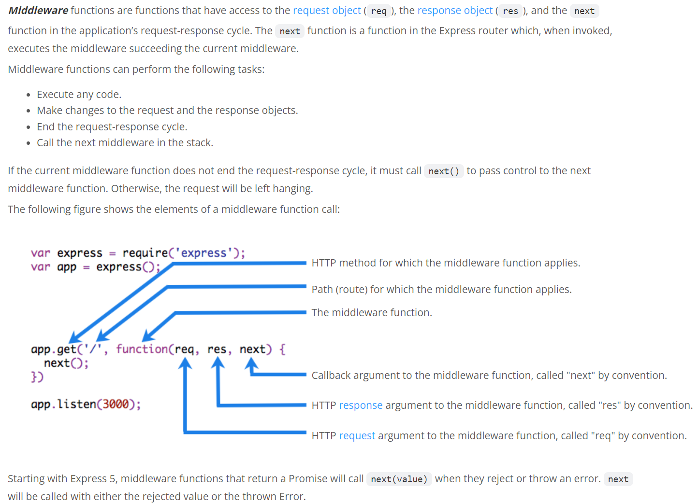

# About
This project is the "backend" for the Practice Project Brief assigned to students of INFO 530 at VCU Business in the Fall of 2024.

Be sure to study the following files: [app.js](https://github.com/ugoetudo/practice_project_etudo/blob/master/app.js), [db.js](https://github.com/ugoetudo/practice_project_etudo/blob/master/db.js), [package.json](https://github.com/ugoetudo/practice_project_etudo/blob/master/package.json) and everything in [routes/*](https://github.com/ugoetudo/practice_project_etudo/tree/master/routes) 


## app.js
This is the entry-point to the Express.js App. Recalling that Express is useful for constructing API endpoints, this module (1) instantiates the `Express` middleware. `Node.js` is the base framework that constructs the web server. Anything `Express` can do, `Node` does as well, but in a less approachable way. Because `Express` gives us an elegant way to define endpoints using routes, and is also just a wrapper around Node functionality, the [app.js](https://github.com/ugoetudo/practice_project_etudo/blob/master/app.js) module is used by `Node` to resolve requests to the server.

Accordingly, in this module, we tell `Node` where to look for execution code when a request is made to a particular endpoint. Notice that, in app.js, we 

1. Import each module that we created in [routes/*](https://github.com/ugoetudo/practice_project_etudo/tree/master/routes): 

```javascript 
        var indexRouter = require('./routes/index');
        var usersRouter = require('./routes/users');
        var enrollemntRouter = require('./routes/enrollment');
```
2. Register the routes using the `Express` middleware:
```javascript
        var app = express();
        app.use('/', indexRouter);
        app.use('/users', usersRouter);
        app.use('/enrollment', enrollemntRouter);
```

Of course, because the app.js is a module (i.e. it will build up one or more objects, then expose that object to other modules) it needs to export something. Note at the end of the file:
```javascript
module.exports = app; 
```

Finally, to understand how this all comes together, take a look at the [www](https://github.com/ugoetudo/practice_project_etudo/blob/master/bin/www) file in the bin directory of your project. First, on line 1 we see a `#!` (pronounced shuh-bang!! you've got to yell it... or you can be boring and call it a sharp-exclamation). After the sharp-exclamation is a path followed by "node." It is an instruction to the program loader (in this case npm) to execute the command 'node' with /usr/bin/env as the path and www as the first argument to the file. If you are in your program's root directory, type 'node' in the terminal followed by the ./bin/wwww and you'll, in a sense be doing the same thing.

Accordingly, the first thing to run when you start up your app is a `Node.js` script - www. This script imports your `app.js` module and uses it as the listener in the all-important function call
```javascript
var app = require('../app');
var server = http.createServer(app);
```
The `http.createServer();` uses the node http module to create a http server. The argument to the createServer() method is a function that receives two positional arguments (positional means that the order in which you supply this matters) (1) request and (2) response. When the server receives a request via http, the supplied function is used to handle it. The function updates the response object which the node http server writes back to the requesting client. For instance:
```javascript
//import node::http:
var http = require('http');
//create a server object:
http.createServer(function (req, res) {
  res.write('Hello World!'); //write a response to the client
  res.end(); //end the response
}).listen(8080); //the server object listens on port 8080
```
Source: [w3schools Node.js Tutorial](https://www.w3schools.com/nodejs/nodejs_http.asp)

We call express a middleware because it exposes a function => (req, res) {} that intercepts http requests. In our www file, your `app` plays this part!


## /routes/*
In the routes directory, we define javascript modules that handle http requests to our server depending on the path supplied in the request. When defining a route module, you must begin by instantiating an express `Router` object:
```javascript
var express = require('express');
var router = express.Router();
```
You then use that `router` object to specify what happens when requests are made to different sudirectories of that endpoint. In the example to follow, we added a directive to the app.js module which says that the users.js route will handle requests made to the /users endpoint: 
```javascript
var usersRouter = require('./routes/users'); //first get the router by importing the desired router module
app.use('/users', usersRouter); //then direct express to use that router to resolve requests against /users
```
In the corresponding route, we can define what happens when a request is made to `/users` (the root of the `users.js` route) or to `/users/*`. To define what happens when when the root of the route receives a http GET request (there are other request types, e.g. http POST, but we can ignore those for now) we ***must*** supply ***two*** positional arguments to `router.get()`: 
1. The endpoint's relative url (e.g. '/' would mean /users/, and '/validate/' would mean '/users/validate/') 
2. An express middleware function, an array of such functions or a combination of independent middleware functions and arrays of such functions to handle requests.
    - The functions must all accept three positional arguments: request, response, and next
        - **request:** express will pass the complete request object to the function
        - **response:** express will pass an empty response object that you can build up in the function
        - **next:** a function that, when called, causes express to execute the next middleware function

[](https://expressjs.com/en/guide/writing-middleware.html)

For instance, in `users.js` we have:
```javascript
//this will handle requests sent to /users
//we pass two functions independently
//the cors function is imported from the node::cors library and is the first of the two to intercept the request
//it verifies that the request meets the common origin requirements you specified in corsOptions, then hands over processing to the next function (cors(), being a middleware function, receives the next() function). 
//the subsequent function is defined anonymously ... function(req, res, next) {...} ... and passes the url query in the request object to a mysql database query.
router.get('/', cors(corsOptions), function(req, res, next) {
  const vnum = req.query.vnum
  connection.query('select first_name, last_name from student_user where vnum = ?', [vnum], (e, r, f) => {
    if (!e) {
      //if there is no error raised by the query() function then we'll write the data we recieved, as JSON, to the response.
      res.json(r[0])
    }
    else {
      //if the query fails, we use the 'next()' function, passing it the error, to invoke our app's error callback method
      next(e)
    }
  })
});
```

## MySQL on Node 
#### *(i.e. frameworks like express and react are all Node so this applies broadly)*
Source [mysqljs Git repo](https://github.com/mysqljs/mysql?tab=readme-ov-file#mysql)

### Establishing Connections
The recommended way to establish a connection is this:

```js
var mysql      = require('mysql');
var connection = mysql.createConnection({
  host     : 'example.org',
  user     : 'bob',
  password : 'secret'
});

connection.connect(function(err) {
  if (err) {
    console.error('error connecting: ' + err.stack);
    return;
  }

  console.log('connected as id ' + connection.threadId);
});
```

However, a connection can also be implicitly established by invoking a query:

```js
var mysql      = require('mysql');
var connection = mysql.createConnection(...);

connection.query('SELECT 1', function (error, results, fields) {
  if (error) throw error;
  // connected!
});
```

Depending on how you like to handle your errors, either method may be
appropriate. Any type of connection error (handshake or network) is considered
a fatal error, see the [Error Handling](#error-handling) section for more
information.

### Performing queries

The most basic way to perform a query is to call the `.query()` method on an object
(like a `Connection`, `Pool`, or `PoolNamespace` instance).

The simplest form of `.query()` is `.query(sqlString, callback)`, where a SQL string
is the first argument and the second is a callback:

```js
connection.query('SELECT * FROM `books` WHERE `author` = "David"', function (error, results, fields) {
  // error will be an Error if one occurred during the query
  // results will contain the results of the query
  // fields will contain information about the returned results fields (if any)
});
```

The second form `.query(sqlString, values, callback)` comes when using
placeholder values (see [escaping query values](#escaping-query-values)):

```js
connection.query('SELECT * FROM `books` WHERE `author` = ?', ['David'], function (error, results, fields) {
  // error will be an Error if one occurred during the query
  // results will contain the results of the query
  // fields will contain information about the returned results fields (if any)
});
```

The third form `.query(options, callback)` comes when using various advanced
options on the query, like [escaping query values](#escaping-query-values),
[joins with overlapping column names](#joins-with-overlapping-column-names),
[timeouts](#timeouts), and [type casting](#type-casting).

```js
connection.query({
  sql: 'SELECT * FROM `books` WHERE `author` = ?',
  timeout: 40000, // 40s
  values: ['David']
}, function (error, results, fields) {
  // error will be an Error if one occurred during the query
  // results will contain the results of the query
  // fields will contain information about the returned results fields (if any)
});
```